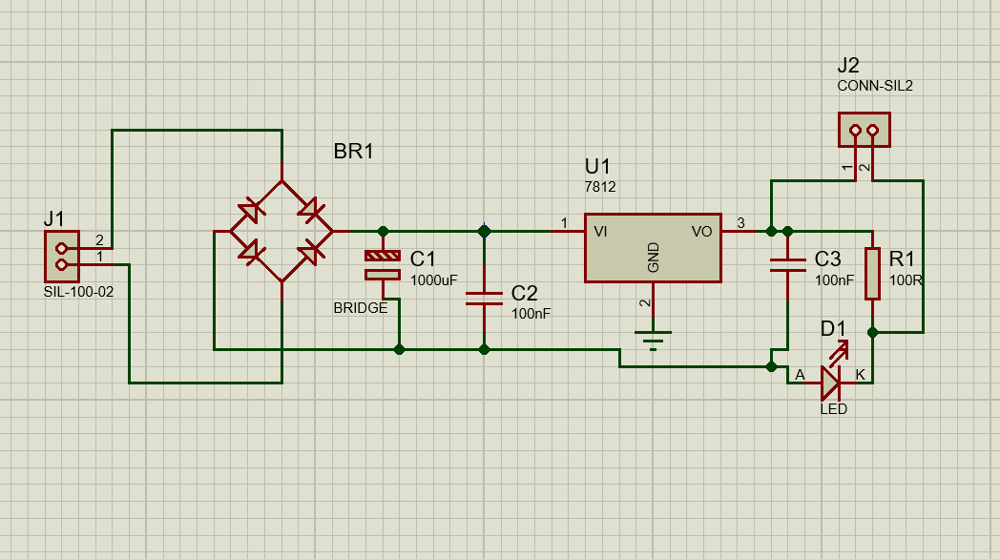
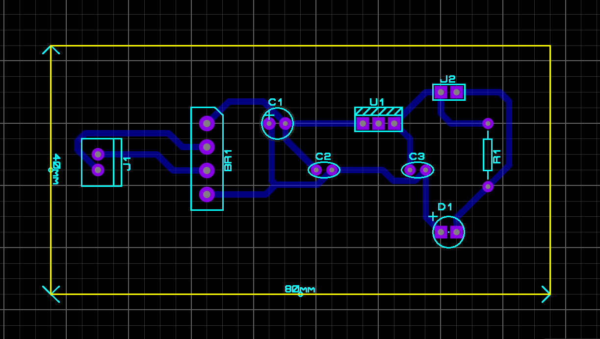
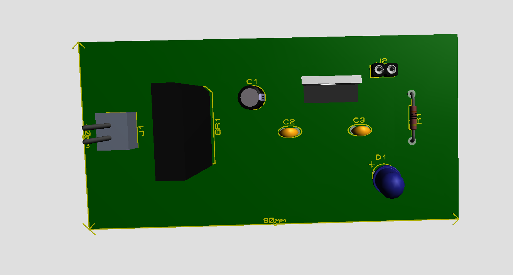
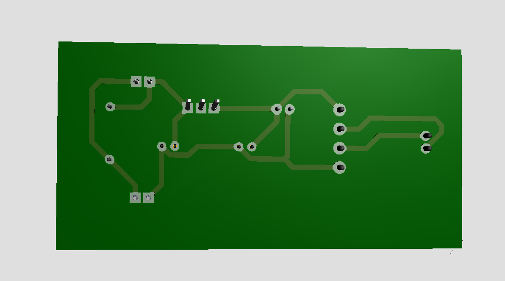

# Protótipo de Carregador - Fonte de Alimentação 12V

Este projeto consiste no desenvolvimento de uma fonte de alimentação linear regulada, projetada no software **Proteus 8 Professional**. O circuito converte uma entrada AC de um transformador em uma saída estável de 12V DC.

##  Requisitos do Projeto
- Placa de circuito impresso (PCB) com dimensões de 8cm x 4cm.
- Trilhas de cobre posicionadas exclusivamente na face inferior (Bottom Layer).
- Documentação: Esquemático, Layout e Visualização 3D.

## Componentes Utilizados
- **J1:** Conector de entrada (conectado ao secundário do transformador).
- **BR1 (Ponte Retificadora):** Ponte de diodos para retificação de onda completa.
- **C1 (1000µF) & C2 (100nF):** Filtros eletrolítico e cerâmico para redução de ripple.
- **U1 (LM7812):** Regulador de tensão positiva de 12V.
- **C3 (100nF):** Estabilização da saída.
- **D1 (LED):** Indicador visual de funcionamento.
- **R1 (100Ω):** Resistor limitador de corrente para o LED.
- **J2:** Conector de saída 12V.

## Desenvolvimento do Projeto

### 1. Esquema Elétrico
O circuito foi desenhado para garantir eficiência na conversão de energia.

### 2. Layout da PCB
O layout foi otimizado para respeitar as dimensões de 80mm x 40mm, utilizando trilhas largas para suportar a corrente de saída.

### 3. Visualização 3D
Representação final do protótipo com a disposição física dos componentes.

---

## Comportamento do Sinal (Formas de Onda)

Para entender o funcionamento, podemos dividir o sinal em três estágios principais:

1. **Entrada (AC):** Uma onda senoidal pura que alterna entre semiciclos positivos e negativos.
2. **Após a Retificação (Ponte BR1):** O sinal torna-se uma "onda completa retificada", onde os semiciclos negativos são invertidos para o lado positivo.
   3. **Após a Filtragem (Capacitor C1):** O sinal torna-se uma linha quase contínua (DC) com uma pequena oscilação chamada *Ripple*. O regulador 7812 elimina essa oscilação, entregando uma linha perfeitamente reta em 12V.

---
*Projeto desenvolvido para a disciplina de Sistemas Embarcados*